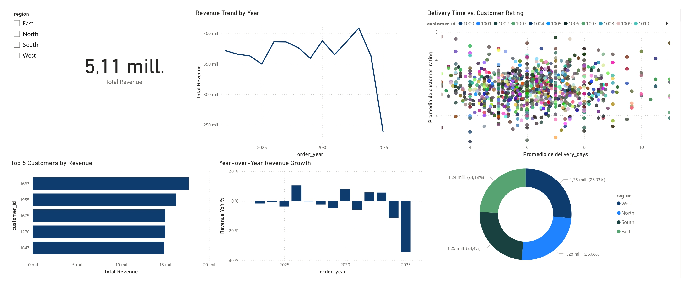

E-Commerce Sales Performance Analysis

End-to-end ETL and BI project developed as part of the RIWI Data Engineering performance test.

## Project Overview

This project takes an e-commerce sales dataset from Kaggle, transforms and validates the data using Python and pandas, loads it into PostgreSQL, and analyzes it in Power BI.

**Dataset:** E-Commerce Sales Performance Analysis
**Rows:** 5,000
**Original columns:** 12

## Business Questions

The Power BI dashboard answers:

1. What is the revenue trend over time?
2. Which are the Top 5 customers by revenue?
3. How is revenue distributed across regions?
4. How does revenue vary year over year?
5. Is there a relationship between delivery time and customer rating?

## ETL Pipeline

### Extract

- CSV dataset from Kaggle
- Loaded with Python and pandas

### Transform

- Checked null values and duplicates
- Corrected data types
- Standardized column names
- Created `order_year` and `order_month`
- Validated numeric ranges
- Created a simple star schema

### Load

- PostgreSQL database: `ecommerce_etl`
- Schema: `public`

Tables:

- `fact_sales`
- `dim_date`
- `dim_product`
- `dim_region`
- `dim_payment_method`

## Power BI Dashboard

The dashboard includes:

- Total Revenue KPI
- Revenue Trend by Year
- Top 5 Customers by Revenue
- Revenue Distribution by Region
- Year-over-Year Revenue Growth
- Delivery Time vs. Customer Rating
- Interactive Region filter
- Dynamic key insights



## Data Validation

| Validation             | Result |
| ---------------------- | -----: |
| Rows                   |  5,000 |
| Null values            |      0 |
| Duplicate rows         |      0 |
| Invalid numeric ranges |      0 |

## Project Structure

```text
SIMULACRO-PRUEBA-ANALISIS/
│
├── data/
│   └── e-commerceSales.csv
│
├── src/
│   └── analysis.py
│
├── sql/
│   └── ecommerce_etl.sql
│
├── powerbi/
│   └── ecommerce_sales_dashboard.pbix
│
├── docs/
│   ├── dataset_fiche.md
│   ├── postgresql_evidence.md
│   ├── conclusions.md
│   └── pipeline.png
│
├── images/
│   ├── powerbi_dashboard.jpg
│   └── postgresql_evidence.jpeg
│
├── README.md
├── requirements.txt
└── .gitignore
```

## Technologies

- Python
- pandas
- SQLAlchemy
- PostgreSQL
- Power BI
- DBeaver

## How to Run

Install the required packages:

```bash
pip install -r requirements.txt
```

Run the ETL script:

```bash
python src/analysis.py
```

The transformed data is loaded into PostgreSQL and can then be connected to Power BI.

## Documentation

- [Dataset Fiche](docs/dataset_fiche.md)
- [PostgreSQL Evidence](docs/postgresql_evidence.md)
- [Conclusions and Insights](docs/conclusions.md)
- [Pipeline Diagram](docs/pipeline.png)
